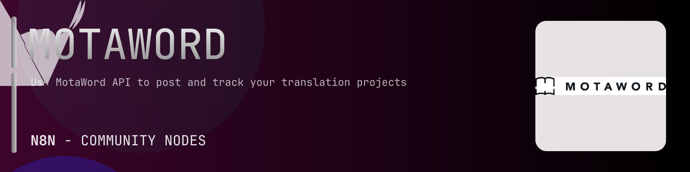

# @n8n-dev/n8n-nodes-motaword



[](https://www.npmjs.com/package/@n8n-dev/n8n-nodes-motaword)
[](https://opensource.org/licenses/MIT)

---

**Stop writing motaword API integrations by hand.**

Every time you connect n8n to motaword, you waste hours mapping endpoints, defining parameters, and debugging schemas. You copy-paste from docs, fix edge cases, and pray nothing breaks.

**What if connecting n8n to motaword took 5 minutes, not half a day?**

This node gives you **27+ resources** out of the box: **Static**, **Async**, **Blog**, **Commission**, **Continuous Project**, and 22 more: with full CRUD operations, typed parameters, and zero manual configuration.

---

## What You Get

- **Zero boilerplate**: Resources, operations, and fields are pre-configured and ready to use
- **Full CRUD**: Create, read, update, and delete support where the API allows it
- **Typed parameters**: No more guessing field types
- **Built-in auth**: API key authentication, ready to go
- **Declarative**: Native n8n performance, no custom execute() overhead

---

## Install

```bash
npm install @n8n-dev/n8n-nodes-motaword
```

**Or in n8n:**
1. **Settings → Community Nodes → Install**
2. Search: `@n8n-dev/n8n-nodes-motaword`
3. Click **Install**

---

## Quick Start

1. Install the node (above)
2. Add credentials: **motaword API** → paste your API key
3. Drag the **motaword** node into your workflow
4. Pick a resource → pick an operation → done.

That's it. No configuration files. No code. It just works.

---

## Resources

<details>
<summary><b>Static</b> (4 operations)</summary>

- Get Available endpoints
- Get List of supported file formats
- Get List of supported languages
- Get OpenAPI YAML representation of our API

</details>

<details>
<summary><b>Async</b> (1 operations)</summary>

- Get Download result of an async operation

</details>

<details>
<summary><b>Blog</b> (1 operations)</summary>

- Get blog posts ordered by created desc by default

</details>

<details>
<summary><b>Commission</b> (2 operations)</summary>

- Get Returns a commission list of current client
- Post Returns a commission list of current client

</details>

<details>
<summary><b>Continuous Project</b> (34 operations)</summary>

- Get View continuous projects
- Post Create a continuous project
- Delete a continuous project
- Get View a continuous project
- Post Update a continuous project
- Get JWT token to be used in analytics dashboards
- Post Save collect analytics data from Active widget
- Post Complete continuous project
- Post Get quote for documents
- Post Complete a continuous project document
- Post Get a quote for a continuous project document
- Post Get quote for languages
- Post Complete continuous project language
- Post Get quote for language
- Delete subscription for continuous project
- Get subscription for continuous project
- Post Create subscription for continuous project
- Put Update subscription for continuous project
- Put Update subscription payment method for continuous project
- Post Instantly translate your content
- Get View continuous documents
- Post Add a new document to your continuous project
- Post Get continuous project document progress for multiple IDs
- Get View a continuous document
- Post Update the document
- Get Monitor progress of a continuous document
- Get Invoices of a continuous project
- Get Monitor progress and status of a continous project
- Get View Active widgets
- Post Create a new Active widget
- Delete a single widget for this Active project
- Get View an Active widget
- Post Update Active widget settings
- Post Reset Active widget token

</details>

<details>
<summary><b>Strings</b> (18 operations)</summary>

- Post Get a list of strings and its translations in the project
- Get View strings their translations in a continuous document
- Get View strings and translations in continuous project
- Delete Clear translation cache
- Get View cached strings translations in continuous project
- Post Recache translations
- Get View strings and translations of a document
- Get View strings and translations of a document for target language
- Get View project strings and translations
- Post Download project translation memory
- Get Check translation memory packaging status
- Post Download language specific project translation memory
- Get Check language specific translation memory packaging status
- Get View strings and translations for target language
- Get View account strings translation memory
- Put Update string translation
- Post Download account translation memory
- Get Check account translation memory packaging status

</details>

<details>
<summary><b>Corporate</b> (12 operations)</summary>

- Get View your corporate account
- Get View available permissions
- Get View user groups
- Post Create or update a corporate user group
- Get View users
- Post Create or update a user
- Get a list of corporate accounts
- Get details of this corporate account
- Get a list of available permissions for this corporate account They are used when assigning permissions to corporate users
- Get a list of user groups for this corporate account
- Post Create or update a corporate user group for this corporate account
- Get a list of users for this corporate account

</details>

<details>
<summary><b>User</b> (49 operations)</summary>

- Delete your account
- Post Downgrade Proofreader
- Get View your vendor earnings
- Post Freeze account
- Post Log user s current location This data is used in our Intelligent Project Manager for various data analysis including project prioritization for vendors and account validation
- Post Make Proofreader
- Get View your account info
- Post Update your account info
- Post Subscribe to push notifications
- Post Unsubscribe Notification
- Post Update your account password
- Get View your payment and billing info
- Post Update payment info
- Get View your permissions
- Post Upload profile picture
- Post Sends email confirmation email for current user
- Get View your vendor responsiveness
- Get View your account statistics
- Post Defreeze your account
- Get View your user groups
- Get a list of platform users
- Post Create a new user
- Post Filter vendors based on provided parameters
- Post Sends password reset email to the user s registered email address
- Get Returns all vendor tags for vendors filter
- Get user information including client or vendor specific info
- Post Update User
- Post Approve Vendor Application
- Delete requester account
- Post Downgrade User Proofreader
- Get Returns your vendor earnings Includes real time earnings from ongoing projects and fixed earnings from completed projects Also includes total earnings and string edits
- Post Freeze requester account for project notifications
- Post Make User Proofreader
- Post Subscribe User Notification
- Post Unsubscribe User Notification
- Get View user s payment and billing info
- Post Update user payment info
- Get Returns a list of permissions that this user is authorized for
- Post Upload User Profile Picture
- Post Reject Vendor Application
- Post Sends email confirmation email for a user
- Get Returns a user s vendor responsivity stats
- Get Returns a user s client and vendor statistics This used to be called summary deprecated
- Get Returns the language pairs that the user has ordered most
- Get Returns a user s project statistics
- Post Suspend User
- Post Unfreeze requester account for project notifications
- Get Returns a list of user groups that this user belongs to
- Post Update User Group

</details>

<details>
<summary><b>Document</b> (9 operations)</summary>

- Get View your documents
- Get a list of subjects of projects
- Get View a single document
- Get View a document translation progress
- Post Regenerate preview and return preview URL for given file
- Get Find documents similar to this document
- Post Use the translation of given source manual document as manual draft source for the given target document
- Post Use the translation of the given manual document as a regular file
- Get a list of your documents

</details>

<details>
<summary><b>Glossary</b> (8 operations)</summary>

- Get Download account glossary
- Post Create or update the account glossary
- Get View glossaries
- Post Upload a glossary file
- Delete a glossary
- Get View a glossary
- Put Update a glossary
- Get Download a glossary

</details>

<details>
<summary><b>Integrations</b> (1 operations)</summary>

- Get Generate a new access token for MotaWord s integrations service

</details>

<details>
<summary><b>Invitation</b> (1 operations)</summary>

- Post Get vendor list for compiled invitation needs

</details>

<details>
<summary><b>Machine Learning</b> (1 operations)</summary>

- Post Get a delivery prediction for a project

</details>

<details>
<summary><b>Pam</b> (3 operations)</summary>

- Post Sends a message to chat
- Get the Pam profile of a client for this client ID
- Get completion report data of a project

</details>

<details>
<summary><b>Payment</b> (5 operations)</summary>

- Post Reset payment code
- Post Manage automatic charges on your credit card
- Get View saved credit card
- Delete credit card
- Post Reset credit card payment code

</details>

<details>
<summary><b>Project</b> (26 operations)</summary>

- Get View your translation projects
- Post Create a new project
- Get Quote ID
- Get List projects as a vendor
- Delete your translation project
- Get View a translation project
- Put Update project info and settings
- Post Assign a CM to the project
- Get Trigger a call to your callback URL related to this project
- Post Cancel your translation project
- Post Deliver project
- Get Download your translated project
- Get Download your translated project language
- Post Send a quote email
- Get View project invoice
- Get Download project invoice HTML
- Get Download project invoice PDF
- Post Launch your translation project
- Post Package your translated project
- Get Track translation packaging status
- Post Package your translated project language
- Get View progress of a project
- Post Recreate your translation project from scratch This is a risky action you will lose current translations
- Post Submit feedback report for a project
- Get a list of vendors
- Get a list of user vendor projects

</details>

<details>
<summary><b>Activity</b> (7 operations)</summary>

- Get sales activities for a project
- Post Insert sales activity for a project
- Get Monitor project activities
- Get View an activity
- Post Submit comment to an activity
- Get View activity comments
- Get View all project comments

</details>

<details>
<summary><b>Project Webhooks</b> (4 operations)</summary>

- Delete project webhooks
- Get View project webhooks
- Post Update project WEBHOOK
- Put Update project WEBHOOK

</details>

<details>
<summary><b>Project Document</b> (7 operations)</summary>

- Get View project source documents
- Post Upload a new document
- Delete the document
- Get View a project source document
- Post Update the document
- Get Download a project source document
- Get Download translated document

</details>

<details>
<summary><b>Style Guide</b> (8 operations)</summary>

- Get View style guides
- Post Upload a new style guide
- Delete a style guide
- Get View a style guide
- Put Update a style guide
- Get Download a style guide
- Get Download account style guide
- Post Create or update the account style guide

</details>

<details>
<summary><b>Report</b> (5 operations)</summary>

- Post Returns available options for selected timeframe
- Post Language pairs report
- Post Projects report
- Post Generate a QA report for given filter
- Post Company users report

</details>

<details>
<summary><b>Search</b> (3 operations)</summary>

- Get Search everything in your account
- Post Reindex for search all of the client source and translation documents
- Get Check reindex status of the client source and translation documents

</details>

<details>
<summary><b>Stats</b> (5 operations)</summary>

- Get Returns the total commissions stats
- Post Returns the total commissions stats by report filter
- Get View your popular language pairs
- Get View your project statistics
- Get View your translation statistics

</details>

<details>
<summary><b>Surveys</b> (2 operations)</summary>

- Get survey questions in given scope and type
- Post survey answers for scope and type

</details>

<details>
<summary><b>Auth</b> (1 operations)</summary>

- Post Retrieve an access token

</details>

<details>
<summary><b>Vendor</b> (1 operations)</summary>

- Post Get a list of vendors available for the criteria given

</details>

<details>
<summary><b>Default</b> (1 operations)</summary>

- Delete Clear cache by key

</details>

---

## Why This Node?

**Without this node:**
- Hours of manual API integration
- Copy-pasting from motaword docs
- Debugging auth, pagination, error handling
- Maintaining your own client code

**With this node:**
- Install → configure → use. 5 minutes.
- Auto-generated from the official motaword OpenAPI spec
- Always up to date when the API changes
- Native n8n performance

---

## Auto-Generated
This node was auto-generated from the official **motaword** OpenAPI specification using
[@n8n-dev/n8n-openapi-node-ultimate](https://github.com/kelvinzer0/n8n-openapi-node-ultimate),
then validated against the live API so you get accurate types and real parameters, not guesswork.

When the motaword API updates, this node updates too.

---


## License

MIT © [kelvinzer0](https://github.com/n8n-code)
